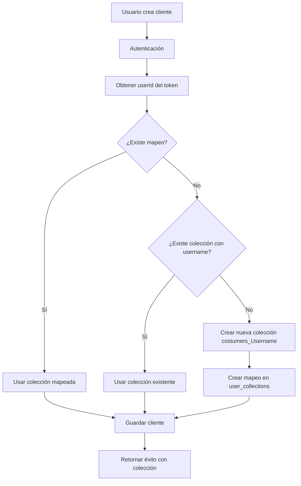

# Sistema de Enrutamiento de Clientes por Agente

## 📋 Resumen

Este documento explica cómo funciona el sistema de asignación automática de clientes a las colecciones correspondientes de cada agente.

## 🎯 Objetivo

**Garantizar que cada lead/cliente creado por un agente se guarde automáticamente en su colección personal**, evitando que todos los datos se acumulen en una sola colección `costumers`.

## 🏗️ Arquitectura

### 1. Tabla de Mapeo: `user_collections`

Esta colección mantiene la relación entre usuarios y sus colecciones de clientes:

```javascript
{
  userId: ObjectId("..."),        // ID del usuario (ObjectId)
  collectionName: "costumers_JulioChavez",  // Nombre de la colección
  displayName: "Julio Chavez",    // Nombre para mostrar
  createdAt: ISODate("..."),
  updatedAt: ISODate("...")
}
```

### 2. Colecciones por Agente

Formato: `costumers_<DisplayName>`

Ejemplos:
- `costumers_Lisbeth_Cortez`
- `costumers_Julio_Chavez`
- `costumers_Fernanda_Castillo`

### 3. Colección Fallback

- `costumers` - Colección por defecto cuando no hay mapeo

## 🔄 Flujo de Creación de Clientes

### POST `/api/customers`



### Código Simplificado

```javascript
// 1. Obtener userId del usuario autenticado
const currentUserIdObj = new ObjectId(req.user._id);

// 2. Buscar mapeo existente
const mapping = await db.collection('user_collections')
  .findOne({ userId: currentUserIdObj });

// 3. Determinar colección destino
let targetCollection = 'costumers'; // Default

if (mapping && mapping.collectionName) {
  // Usar colección mapeada
  targetCollection = mapping.collectionName;
} else {
  // Crear nueva colección basada en username
  const displayName = req.user.username.replace(/\s+/g, '_');
  targetCollection = `costumers_${displayName}`;
  
  // Crear mapeo
  await db.collection('user_collections').updateOne(
    { userId: currentUserIdObj },
    { 
      $set: { 
        collectionName: targetCollection,
        displayName: req.user.username,
        updatedAt: new Date()
      },
      $setOnInsert: { createdAt: new Date() }
    },
    { upsert: true }
  );
}

// 4. Guardar en la colección determinada
await db.collection(targetCollection).insertOne(customerData);
```

## 🔍 Flujo de Lectura de Clientes

### GET `/api/customers`

```javascript
// 1. Verificar si el usuario tiene mapeo
const mapping = await db.collection('user_collections')
  .findOne({ userId: req.user._id });

// 2. Usar colección mapeada o default
const collectionName = mapping?.collectionName || 'costumers';

// 3. Consultar desde la colección correcta
const customers = await db.collection(collectionName).find(query).toArray();
```

## 📊 Ranking Global

El endpoint `/api/ranking` con `all=1` agrega datos de **TODAS** las colecciones `costumers*`:

```javascript
// 1. Listar todas las colecciones que empiezan con 'costumers'
const collections = await db.listCollections().toArray();
const costumersCollections = collections
  .filter(c => /^costumers(_|$)/i.test(c.name));

// 2. Ejecutar aggregation en cada una
for (const colName of costumersCollections) {
  const results = await db.collection(colName)
    .aggregate(rankingPipeline).toArray();
  allResults = allResults.concat(results);
}

// 3. Fusionar resultados por agente
const mergedResults = mergeByAgentName(allResults);

// 4. Ordenar descendente por puntos
mergedResults.sort((a, b) => b.puntos - a.puntos);
```

## 🛠️ Scripts de Migración

### 1. Crear Mapeos Iniciales

```bash
node scripts/mongo/backfill_normalize_collections.js --dry-run
node scripts/mongo/backfill_normalize_collections.js --apply
```

Este script:
- Escanea todas las colecciones `costumers_*`
- Busca el usuario correspondiente por nombre
- Crea el mapeo en `user_collections`

### 2. Normalizar agenteId

```bash
node scripts/mongo/convert_agenteId_to_objectid.js --apply
```

Convierte campos `agenteId` de string a ObjectId para consistencia.

### 3. Verificar Estado

```bash
node scripts/test-customer-creation.js
```

Muestra:
- Mapeos existentes
- Colecciones y número de documentos
- Usuarios sin mapeo
- Colecciones huérfanas

## ✅ Verificación Post-Creación

Cuando un cliente se crea exitosamente, el servidor devuelve:

```json
{
  "success": true,
  "message": "Cliente creado exitosamente",
  "id": "674abc...",
  "collection": "costumers_Lisbeth_Cortez",
  "agent": "Lisbeth Cortez"
}
```

### Logs del Servidor

```
=== INTENTANDO GUARDAR EN LA BASE DE DATOS ===
Colección destino: costumers_Lisbeth_Cortez
Usuario: Lisbeth Cortez
[POST /api/customers] Mapeo encontrado para userId: 68e... -> colección: costumers_Lisbeth_Cortez
=== CLIENTE GUARDADO EXITOSAMENTE ===
ID del cliente: 674abc...
Colección utilizada: costumers_Lisbeth_Cortez
```

## 🚨 Troubleshooting

### Problema: Clientes se guardan en `costumers` en lugar de colección personal

**Causa**: No existe mapeo en `user_collections`

**Solución**:
```bash
# Ejecutar script de backfill
node scripts/mongo/backfill_normalize_collections.js --apply
```

### Problema: Usuario nuevo no tiene colección

**Solución**: 
- El sistema creará automáticamente la colección y el mapeo en la primera creación de cliente
- O ejecutar manualmente:

```bash
node scripts/mongo/upsert_user_collection_mapping.js \
  --userId "68e976..." \
  --collection "costumers_NuevoAgente" \
  --displayName "Nuevo Agente"
```

### Problema: Clientes duplicados en múltiples colecciones

**Causa**: Datos históricos de antes de implementar el sistema de mapeo

**Solución**: 
1. Identificar colección canónica del agente
2. Usar script de consolidación:

```bash
node scripts/mongo/consolidate_agent_collections.js \
  --agentId "68e976..." \
  --targetCollection "costumers_AgenteName" \
  --dry-run

# Si todo se ve bien:
node scripts/mongo/consolidate_agent_collections.js \
  --agentId "68e976..." \
  --targetCollection "costumers_AgenteName" \
  --apply
```

## 📝 Checklist de Implementación

- [x] Endpoint POST usa mapeo `user_collections`
- [x] Endpoint GET usa mapeo `user_collections`
- [x] Endpoint ranking agrega desde todas las colecciones
- [x] Creación automática de mapeo para usuarios nuevos
- [x] Logs detallados de colección destino
- [x] Response incluye colección utilizada
- [x] Scripts de migración disponibles
- [x] Documentación completa

## 🎓 Mejores Prácticas

1. **Siempre verificar logs**: Después de crear un cliente, revisar que se guardó en la colección correcta
2. **Ejecutar backfill después de cambios**: Si se agregan usuarios nuevos manualmente en DB
3. **Monitorear colecciones huérfanas**: Usar script de verificación regularmente
4. **Backup antes de consolidación**: Exportar datos antes de mover entre colecciones

## 📚 Referencias

- **Endpoint POST**: `server.js` línea ~2912
- **Endpoint GET**: `server.js` línea ~1906
- **Endpoint Ranking**: `routes/ranking.js` línea ~20
- **Scripts**: `scripts/mongo/*.js`
